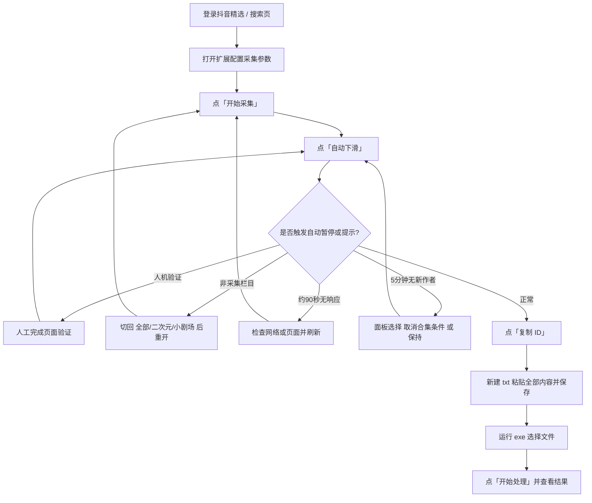

# 抖音 AI 合集作者采集 — 使用流程 SOP

| 项目 | 内容 |
|---|---|
| 文档版本 | v1.2 |
| 适用版本 | 扩展 v1.1.2 |
| 更新日期 | 2026-09-22 |
| 适用范围 | 采集团队全体成员 |
| 关联工具 | `douyin_sec_id_upload_tool.exe` |

---

## 1. 目的

规范「抖音 AI 合集作者」的采集、导出与上传流程，确保操作一致、数据准确、账号安全。

采集目标：收集同时满足以下三个条件的作者唯一标识 `sec_uid`。

1. 视频**挂载了合集**
2. 视频带有作者声明：**内容由 AI 生成**
3. **内容类型属于 AI 漫剧 / 短剧 / 动画**（合集名或昵称命中白名单、不撞黑名单）

> 前两个条件都满足才会入库，可在插件里取消勾选以放宽；**内容类型为硬门槛，不可关闭**，用于过滤真人短剧等非 AI 内容。

---

## 2. 适用范围

- 采集页面：抖音**精选**（`www.douyin.com/jingxuan`）、**搜索**（`www.douyin.com/search/…`）、**推荐**。
- 浏览器：Chrome 或 Edge（均在开发者模式下加载未打包扩展）。
- 数据流向：浏览器本地采集 → 复制 `sec_uid` → 粘贴到 txt → exe 工具上传。

---

## 3. 前置条件

- [ ] 已安装 Chrome 或 Edge 浏览器。
- [ ] 拥有抖音账号，且能在目标电脑上正常登录。
- [ ] 拿到扩展源码目录（包含 `manifest.json` 的文件夹）。
- [ ] 拿到 `douyin_sec_id_upload_tool.exe`。

---

## 4. 关键术语

| 术语 | 含义 |
|---|---|
| `sec_uid` | 抖音作者唯一标识，形如 `MS4wLjABAAAA…`，是最终要上传的数据 |
| 合集 | 视频挂载的「合集 / mix」入口，接口字段为 `mix_info` / `mixInfo` |
| AI 声明 | 文案「内容由 AI 生成」或接口 `aigc_info.aigc_label_type === 1` |
| 内容类型 | 合集名/昵称命中的 AI 内容类别（漫剧/短剧/AIGC/动画等），是采集硬门槛 |
| 采集栏目 | 仅「全部 / 二次元 / 小剧场」三个栏目属于采集范围 |
| 自动下滑 | 脚本模拟滚动加载更多内容 |

---

## 5. 首次安装

1. 打开 Chrome，地址栏输入 `chrome://extensions/` 回车。Edge 为 `edge://extensions/`。
2. 打开页面右上角的 **开发者模式** 开关。
3. 点击 **加载已解压的扩展程序**。
4. 在弹出的文件选择框中，选中扩展源码目录（**包含 `manifest.json` 的那一层**），点确定。
5. 确认扩展列表中出现了「抖音 AI 合集作者采集」。
6. （可选）将插件图标固定到工具栏，方便点击。

> 更新扩展时，在本页点击插件的 **重新加载** 按钮，再刷新抖音页面即可生效。

---

## 6. 采集标准操作流程

以下为标准操作全流程总览（Mermaid 图，需用支持 Mermaid 的编辑器渲染，如 Typora / VS Code / GitHub）：

### 6.1 打开页面

1. 登录 [抖音精选](https://www.douyin.com/jingxuan)，或先进入搜索页。
2. 确认页面已登录、能正常浏览内容。

### 6.2 配置采集参数

点击插件图标打开弹窗，或看页面右上角浮层面板，按需设置：

| 参数 | 默认 | 说明 |
|---|---|---|
| 必须挂载合集 | 勾选 | 取消勾选可放宽采集条件 |
| 必须「内容由 AI 生成」 | 勾选 | 约等于必选，一般不取消 |
| 自动间隔 | 4 秒 | 可选 4 / 6 / 8 秒（建议保持 4 秒，防风控） |
| 自动换栏目 | 关闭 | 仅**精选页**生效，需要时手动打开 |
| 自动换搜索词 | 关闭 | 仅**搜索页**生效，需要时手动打开 |

### 6.3 启动采集

1. 点 **开始采集**。
2. 点 **自动下滑**（精选/搜索页持续滚动加载更多；播放页会自动切下一条）。

### 6.4 运行中监控

在浮层面板观察：

- **作者**：已命中并去重入库的作者数量。
- **已扫视频**：累计扫描过的视频数。
- 命中时面板会闪红提示「新命中 N 位作者」。

### 6.5 自动暂停场景与处理

脚本遇到以下情况会**自动停止或提示**，需人工介入：

| 场景 | 面板/通知表现 | 处理动作 |
|---|---|---|
| 人机验证 | 面板变红 + 系统通知「检测到人机验证」 | 人工完成页面验证，再点「自动下滑」恢复 |
| 账号被登出 | 面板变红 + 通知「账号已登出」 | 重新登录后先手动浏览几分钟，再重新开始采集 |
| 非采集栏目 | 面板变红 + 通知「非采集栏目」 | 切回「全部 / 二次元 / 小剧场」后重新开始 |
| 连续无响应（约 90 秒无数据） | 面板变红 + 通知「连续无响应，已自动停止」 | 检查网络或页面状态，刷新后重新开始 |
| 连续 5 分钟无新作者 | 面板浮出「取消合集条件 / 保持」选择框 | 按需选择是否放宽合集条件 |

> 以上提示均为**页面浮层 + 浏览器系统通知**，不会弹阻断式窗口，后台挂机也不会假死。

### 6.6 停止采集

1. 点 **停止采集**（或浮层面板「停止采集」）。
2. 停止后数据已自动保存在本地，可直接导出。

---

## 7. 数据导出

有多种导出方式，目标都是拿到 `sec_uid` 列表：

| 方式 | 位置 | 产出 |
|---|---|---|
| 复制 ID | 浮层面板「复制 ID」 | 剪贴板，每行一个 `sec_uid` |
| 复制 sec_uid | 弹窗「复制 sec_uid」 | 同上 |
| 导出 TXT | 弹窗 | `douyin-ai-mix-authors.txt`，每行一个 |
| 导出 CSV | 弹窗 | 含昵称、sec_uid、合集名等字段 |
| 导出 JSON | 弹窗 | 完整结构化数据 |

---

## 8. 数据上传（exe 工具）

1. 在采集工具上点击 **复制 ID**。
2. 新建一个 `txt` 文本文档。
3. 将**当日当次**复制到的全部内容粘贴到 txt 文本文档中。
4. 按 `Ctrl + S` 保存。
5. 双击运行 `douyin_sec_id_upload_tool.exe`。
6. 在工具界面点击 **选择文件**，选中刚保存的 txt 文档。
7. 点击 **开始处理**。
8. 查看界面显示的**处理结果**，确认上传成功。

---

## 9. 自动换栏目 / 换搜索词

两者默认关闭，需在浮层或弹窗手动开启，用于扩大覆盖、避免单一内容池收敛。

| 功能 | 生效页 | 轮换范围 | 触发条件 |
|---|---|---|---|
| 自动换栏目 | 精选 | 全部 → 二次元 → 小剧场 循环 | 滚满 40 次或连续卡住 3 次 |
| 自动换搜索词 | 搜索 | 48 个「AI 品类 + 题材」组合词随机乱序 | 滚满 30 次或连续卡住 3 次 |

> 换搜索词内置 **5 分钟全局冷却**，跨标签页、跨刷新均生效，避免频繁整页刷新导致页面崩溃或触发风控。
> 搜索词品类已全部 AI 强绑定：AI漫剧 / AI短剧 / AIGC漫剧 / AIGC短剧 / AI动画 / AIGC动画。
> 栏目/搜索词切换进度存在页面会话（`sessionStorage`）里，刷新后可继续；关闭标签页后从头开始。

---

## 10. 安全与防封规范

1. 插件**只被动读取**浏览器里抖音页面自身发出的请求与页面文案，**不主动发请求、不伪造签名**。
2. 检测到人机验证时，脚本会自动暂停，**切勿频繁硬刷**，先人工完成验证。
3. 检测到账号被登出时，脚本会自动停止并提醒；重新登录后先手动浏览几分钟再重新开始，避免登录后立刻高频采集再次触发风控。
4. 滑动间隔默认 **4 秒起步**，请勿手动调回更快档位（已移除 2.8 秒及以下）。
5. 多台电脑/多账号分发使用，务必遵守：**一台电脑 = 一个账号 + 一个 Chrome 用户（profile）**，避免作者列表串号。
6. 各台电脑的搜索词起点、滑动间隔应**略有差异**，降低被抖音按行为指纹判定为群控的风险。

---

## 11. 异常提示对照表

| 面板提示（摘要） | 含义 | 处理 |
|---|---|---|
| 检测到人机验证 | 页面出现验证弹窗 | 人工验证后点自动下滑恢复 |
| 非采集栏目「xx」 | 当前栏目不在采集范围 | 切回全部/二次元/小剧场 |
| 连续无响应 | 约 90 秒无新数据 | 检查网络或页面，刷新重开 |
| 账号已登出 | 账号被强制下线需重新登录 | 重新登录后稍等再重开采集 |
| 已 5 分钟无新作者 | 长时间没新增 | 选择是否放宽合集条件 |
| 检测到服务异常 | 抖音返回异常 | 脚本会自动刷新，稍等观察 |
| 换搜索词/栏目 → xx | 正常触发切换 | 无需处理 |

---

## 12. 常见问题（FAQ）

**Q1：为什么采集了半天作者数没增加？**
A：可能长期停留在单一栏目/关键词导致内容收敛，建议开启自动换栏目或换搜索词；也可能是「必须挂载合集」过滤过严，可尝试放宽。

**Q2：页面一直提示「连续无响应」自动停止？**
A：检查网络是否正常、抖音是否仍在推荐流；刷新页面后重新开始采集。

**Q3：切到某个栏目后就停了？**
A：当前栏目不属于「全部 / 二次元 / 小剧场」范围，属正常守卫行为，切回采集栏目即可。

**Q4：上传工具选文件后没反应？**
A：确认 txt 里是每行一个 `sec_uid`，且文件已 `Ctrl+S` 保存后再选择该文件。